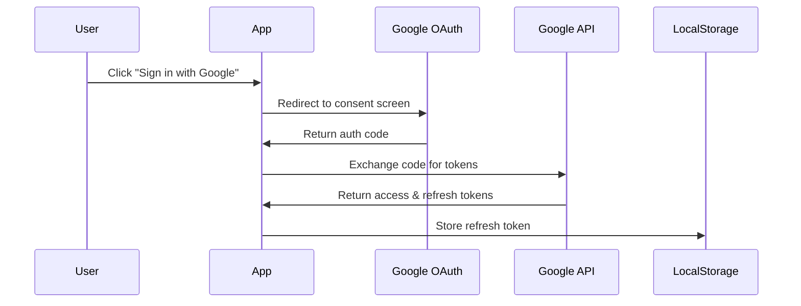

# YouTube Integration Design

## Overview
Add Google/YouTube authentication and playlist management to enable users to access and play videos from their YouTube playlists.

## Technical Architecture

### 1. Authentication Flow


### 2. API Integration

#### Required Google APIs
- YouTube Data API v3
- Google OAuth 2.0
- Google Identity Services

#### Endpoints to Use
```typescript
interface YouTubeEndpoints {
  playlists: '/youtube/v3/playlists'
  playlistItems: '/youtube/v3/playlistItems'
  videos: '/youtube/v3/videos'
}
```

### 3. Data Models

#### User Authentication
```typescript
interface AuthState {
  accessToken: string | null;
  refreshToken: string | null;
  expiresAt: number | null;
  isAuthenticated: boolean;
}
```

#### Playlist Types
```typescript
interface Playlist {
  id: string;
  title: string;
  description: string;
  thumbnailUrl: string;
  itemCount: number;
}

interface PlaylistItem {
  id: string;
  videoId: string;
  title: string;
  thumbnailUrl: string;
  position: number;
}
```

### 4. Component Architecture

#### New Components
```
src/
  components/
    auth/
      GoogleAuthButton.tsx
      AuthProvider.tsx
    playlists/
      PlaylistSelector.tsx
      PlaylistGrid.tsx
      PlaylistItem.tsx
    youtube/
      YouTubeService.ts
      useYouTube.ts
```

### 5. State Management

#### Authentication Context
```typescript
interface AuthContext {
  isAuthenticated: boolean;
  login: () => Promise<void>;
  logout: () => void;
  refreshAccessToken: () => Promise<void>;
}
```

#### YouTube Data Context
```typescript
interface YouTubeContext {
  playlists: Playlist[];
  selectedPlaylist: Playlist | null;
  playlistItems: PlaylistItem[];
  loading: boolean;
  error: Error | null;
  fetchPlaylists: () => Promise<void>;
  fetchPlaylistItems: (playlistId: string) => Promise<void>;
}
```

### 6. Implementation Phases

1. Authentication Setup
   - Configure Google Cloud Project
   - Implement OAuth flow
   - Add token management

2. API Integration
   - Create YouTube service
   - Implement API calls
   - Add error handling

3. UI Components
   - Build auth button
   - Create playlist selector
   - Implement video grid

4. State Management
   - Add auth context
   - Create YouTube context
   - Implement data caching

### 7. Security Considerations

1. Token Storage
   - Store refresh token in secure localStorage
   - Never store access tokens
   - Implement token rotation

2. API Security
   - Use environment variables for API keys
   - Implement rate limiting
   - Add request validation

3. Scope Management
   - Request minimal required scopes
   - Handle permission changes
   - Implement scope validation

### 8. Error Handling

```typescript
enum YouTubeError {
  AUTH_FAILED = 'Authentication failed',
  TOKEN_EXPIRED = 'Token expired',
  PLAYLIST_NOT_FOUND = 'Playlist not found',
  API_ERROR = 'YouTube API error',
  NETWORK_ERROR = 'Network error',
}

interface ErrorHandler {
  handleAuthError: (error: Error) => void;
  handleAPIError: (error: Error) => void;
  handleNetworkError: (error: Error) => void;
}
```

### 9. User Experience

1. Authentication Flow
   - One-click Google sign-in
   - Persistent authentication
   - Clear error messages

2. Playlist Management
   - Grid view of playlists
   - Search/filter capabilities
   - Playlist thumbnails

3. Video Selection
   - Thumbnail previews
   - Video details on hover
   - Quick play functionality

### 10. Environment Setup

```env
VITE_GOOGLE_CLIENT_ID=your_client_id
VITE_GOOGLE_API_KEY=your_api_key
VITE_YOUTUBE_API_BASE_URL=https://www.googleapis.com/youtube/v3
```

### 11. Testing Strategy

1. Unit Tests
   - Auth flow
   - API calls
   - State management

2. Integration Tests
   - Google OAuth flow
   - Playlist fetching
   - Video playback

3. E2E Tests
   - Complete user flow
   - Error scenarios
   - Token refresh

### 12. Performance Considerations

1. Data Caching
   - Cache playlist data
   - Implement pagination
   - Optimize thumbnail loading

2. API Usage
   - Batch requests
   - Implement rate limiting
   - Cache API responses

3. Load Times
   - Lazy load components
   - Optimize bundle size
   - Progressive loading

### 13. Future Enhancements

1. Features
   - Playlist search
   - Multiple accounts
   - Offline access

2. Performance
   - PWA support
   - Background updates
   - Video preloading

3. Integration
   - Share playlists
   - Custom playlists
   - Cross-device sync